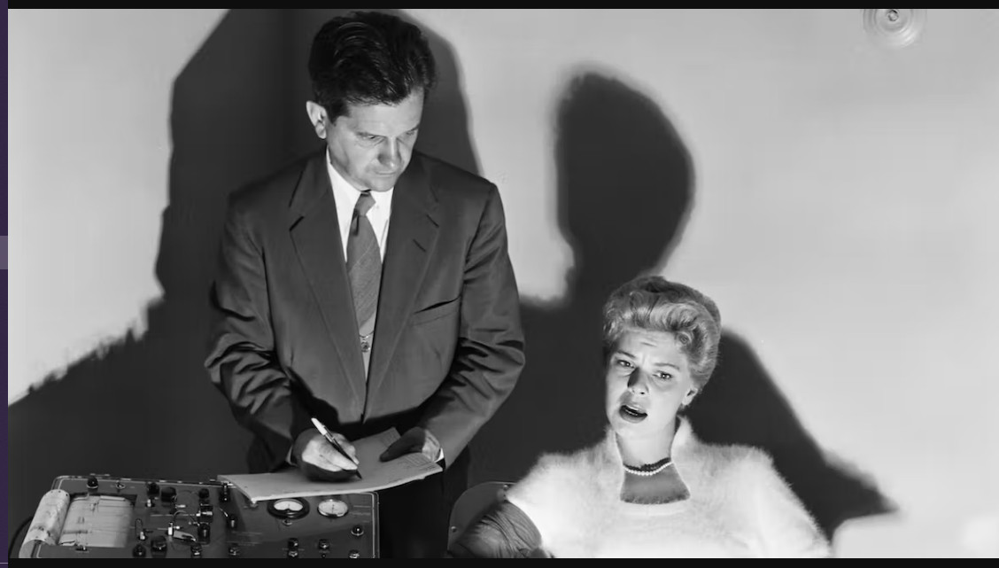

# DAG_Lie_Detector

This repo includes a folder
of jupyter notebooks
that
takes the software through its paces.

The Python code in this repo calculates
the Goodness of Causal Fit (GCF)
for all the DAGs in a set,
using the algorithm proposed in
the following paper:

* [Goodness of Causal Fit](https://github.com/rrtucci/goodness-c-fit/blob/master/gcf.pdf) by Robert R. Tucci

